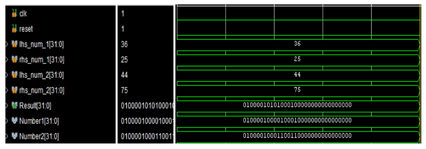

- In the above simulation, the inputs given are 36.25
and 44.75.
- The floating point representations of the two
inputs are Number1 and Number2 respectively.
- Result is the output we get after performing the
addition operation, which is 81 represented in
floating point format.

